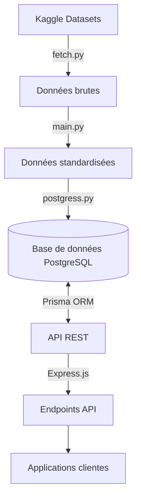
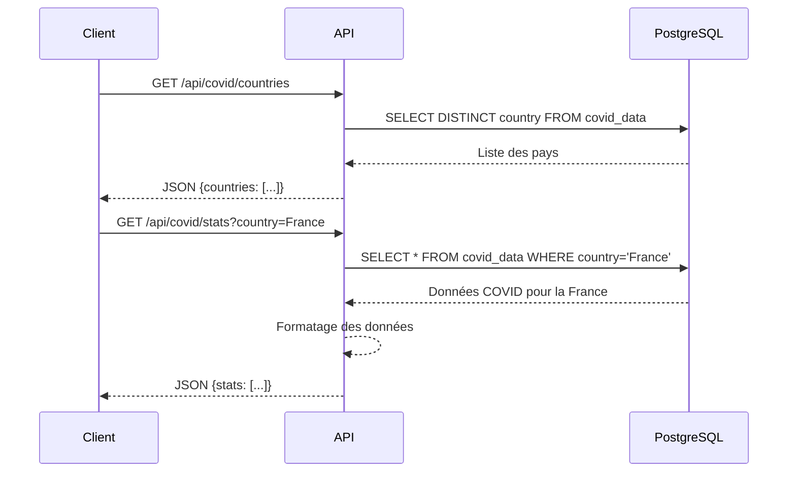

# Architecture du projet

Cette page détaille l'architecture technique du projet MSPR 6.1, présentant les différents composants et leur interaction.

## Vue d'ensemble

Le projet MSPR 6.1 est structuré en deux parties principales:

1. **Module de traitement des données (Python)** - Responsable de l'acquisition, du traitement et du stockage des données épidémiologiques.
2. **API REST (Node.js/TypeScript)** - Expose les données traitées via une interface API RESTful.



## Module de traitement des données

### Composants principaux

-   **fetch.py**: Script responsable du téléchargement des datasets depuis Kaggle
-   **main.py**: Noyau du traitement de données, effectuant la standardisation et la normalisation
-   **postgress.py**: Gère l'importation des données traitées dans PostgreSQL

### Flux de traitement

1. **Acquisition** - Les données sont téléchargées depuis Kaggle via l'API Kaggle
2. **Standardisation** - Les colonnes sont renommées pour suivre une convention commune
3. **Enrichissement** - Calcul de métriques supplémentaires (comme les cas récupérés quotidiens)
4. **Filtrage** - Élimination des données non pertinentes ou incomplètes
5. **Stockage** - Import dans des tables PostgreSQL structurées

## API REST

### Technologies utilisées

-   **Node.js** - Environnement d'exécution
-   **TypeScript** - Langage de programmation typé
-   **Express.js** - Framework web
-   **Prisma** - ORM pour l'interaction avec la base de données
-   **Swagger/OpenAPI** - Documentation automatique de l'API

### Structure des dossiers

```
rest/
├── src/
│   ├── index.ts          # Point d'entrée de l'application
│   ├── docs.ts           # Configuration de la documentation
│   ├── routes/           # Définition des endpoints API
│   └── middleware/       # Middlewares Express
├── prisma/               # Configuration Prisma et modèles de données
└── docs/                 # Documentation générée
```

### Modèle de données

Les deux principales entités de données sont:

1. **COVID Data**

    - Date
    - Pays
    - Cas totaux
    - Nouveaux cas
    - Cas actifs
    - Décès totaux
    - Nouveaux décès
    - Récupérations totales
    - Récupérations quotidiennes

2. **MPOX Data**
    - Date
    - Pays
    - Cas totaux
    - Nouveaux cas
    - Décès totaux
    - Nouveaux décès

## Sécurité et performances

### Sécurité

-   Validation des entrées sur tous les endpoints API
-   Contrôle des taux de requêtes pour prévenir les abus
-   Sanitisation des requêtes SQL via Prisma ORM

### Performances

-   Indexation des tables PostgreSQL sur les champs fréquemment recherchés
-   Mise en cache des réponses pour les requêtes populaires
-   Pagination des résultats pour gérer les grands ensembles de données

## Évolutivité

L'architecture permet d'étendre facilement le système:

-   Ajout de nouveaux jeux de données (ex: autres maladies)
-   Extension des endpoints API
-   Intégration de fonctionnalités d'analyse avancées

## Diagramme de séquence


