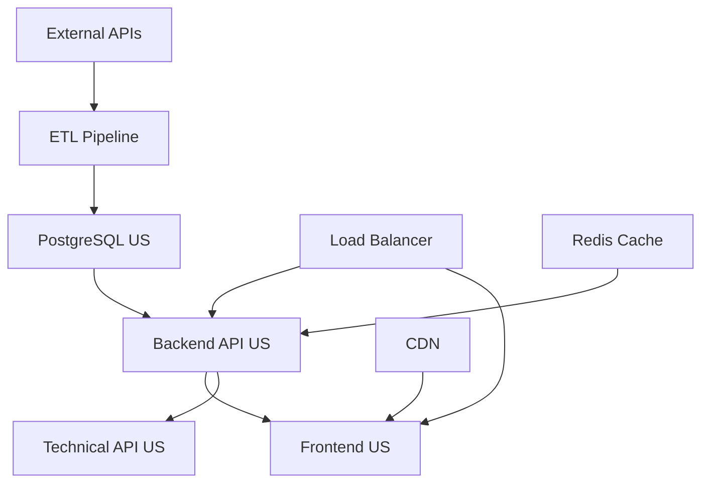
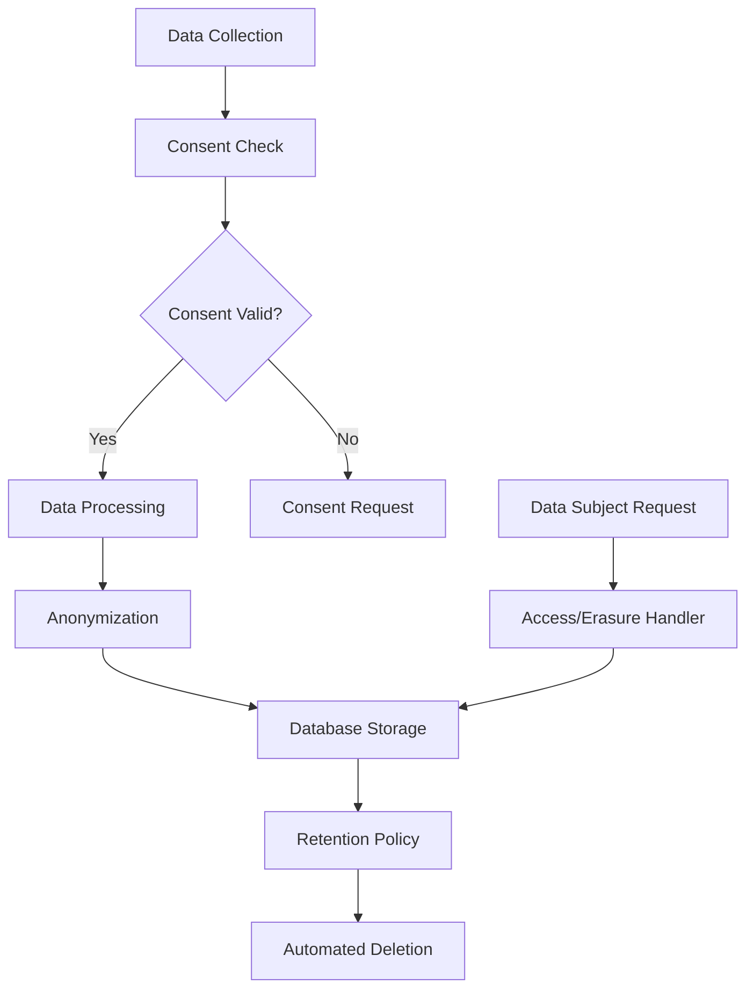

# MSPR System Architecture

## Overview
The MSPR (Surveillance des Pandémies) system is designed as a scalable, secure, and compliant platform for pandemic surveillance across three distinct geographical clusters: United States, France, and Switzerland. Each cluster has specific requirements and compliance needs.

## Architecture Principles

### 1. Microservices Architecture
- **Modularity**: Independent services with clear boundaries
- **Scalability**: Services can be scaled independently
- **Maintainability**: Easier to update and maintain individual components
- **Technology Diversity**: Different services can use optimal technologies

### 2. Cloud-Native Design
- **Containerization**: All services run in Docker containers
- **Orchestration**: Kubernetes for production deployments
- **Service Mesh**: Secure inter-service communication
- **Observability**: Comprehensive monitoring and logging

### 3. Security-First Approach
- **Zero Trust**: Verify every transaction and request
- **Defense in Depth**: Multiple layers of security controls
- **Encryption**: Data encrypted in transit and at rest
- **Compliance**: GDPR compliance for France cluster

### 4. High Availability
- **Redundancy**: Multiple instances of critical services
- **Load Balancing**: Traffic distribution across instances
- **Failover**: Automatic recovery from failures
- **Backup**: Regular automated backups

## System Components

### Frontend Layer

#### Next.js Application
```typescript
// Architecture: Static Site Generation + API Routes
const frontendConfig = {
  framework: 'Next.js 15',
  rendering: 'SSG + SSR',
  styling: 'Tailwind CSS',
  charting: 'Recharts',
  stateManagement: 'React Context + SWR',
  buildTool: 'Turbopack',
  deployment: 'Docker Container'
};
```

**Responsibilities:**
- User interface rendering
- Data visualization (charts and graphs)
- Client-side routing and navigation
- Form handling and validation
- Real-time data updates
- Multi-language support (Switzerland)

**Technology Stack:**
- **Framework**: Next.js 15 with React 19
- **Styling**: Tailwind CSS v4
- **Charts**: Recharts for data visualization
- **HTTP Client**: Axios with SWR for caching
- **Build Tool**: Turbopack for fast builds
- **Package Manager**: pnpm

### Backend Layer

#### API Gateway / Backend Service
```typescript
// Architecture: RESTful API with Express.js
const backendConfig = {
  framework: 'Express.js',
  language: 'TypeScript',
  orm: 'Prisma',
  database: 'PostgreSQL',
  authentication: 'JWT + Bearer Token',
  documentation: 'OpenAPI/Swagger',
  deployment: 'Docker Container'
};
```

**Responsibilities:**
- RESTful API endpoints
- Business logic processing
- Data validation and sanitization
- Authentication and authorization
- Rate limiting and security
- GDPR compliance (France cluster)

**Technology Stack:**
- **Runtime**: Node.js 20
- **Framework**: Express.js
- **Language**: TypeScript
- **ORM**: Prisma (v6.10.1)
- **Validation**: Custom middleware
- **Documentation**: OpenAPI/Swagger

#### API Technical Service (US Cluster Only)
```typescript
// Raw data access for advanced users
const technicalApiConfig = {
  purpose: 'Raw data access',
  authentication: 'Enhanced security',
  rateLimit: '1000 requests/hour',
  dataFormat: 'JSON + CSV export',
  deployment: 'Separate container'
};
```

### Data Layer

#### PostgreSQL Database
```sql
-- Database architecture: Multi-tenant with cluster isolation
CREATE SCHEMA mspr_us;
CREATE SCHEMA mspr_france;
CREATE SCHEMA mspr_switzerland;

-- Tables for each cluster
CREATE TABLE mspr_us.covid_data (
    id SERIAL PRIMARY KEY,
    country VARCHAR(255) NOT NULL,
    date DATE NOT NULL,
    cases INTEGER NOT NULL,
    deaths INTEGER NOT NULL,
    recovered INTEGER NOT NULL,
    created_at TIMESTAMP DEFAULT NOW(),
    updated_at TIMESTAMP DEFAULT NOW()
);

CREATE TABLE mspr_us.mpox_data (
    id SERIAL PRIMARY KEY,
    country VARCHAR(255) NOT NULL,
    date DATE NOT NULL,
    cases INTEGER NOT NULL,
    deaths INTEGER NOT NULL,
    created_at TIMESTAMP DEFAULT NOW(),
    updated_at TIMESTAMP DEFAULT NOW()
);
```

**Data Management Features:**
- **Partitioning**: Data partitioned by cluster and date
- **Indexing**: Optimized indexes for query performance
- **Backup**: Automated daily backups with encryption
- **Replication**: Read replicas for scaling
- **Retention**: Automated data purging based on policies

#### ETL Pipeline (US and France Clusters)
```python
# ETL Architecture: Python-based data processing
etl_pipeline = {
    'extraction': 'WHO API + CSV files',
    'transformation': 'pandas + custom filters',
    'loading': 'PostgreSQL via SQLAlchemy',
    'scheduling': 'Cron jobs in container',
    'monitoring': 'Prometheus metrics'
}
```

**ETL Process:**
1. **Extract**: Fetch data from WHO APIs and CSV files
2. **Transform**: Clean, validate, and filter data
3. **Load**: Insert into PostgreSQL database
4. **Monitor**: Track processing metrics and errors

### Infrastructure Layer

#### Container Orchestration
```yaml
# Kubernetes deployment architecture
apiVersion: apps/v1
kind: Deployment
metadata:
  name: mspr-backend-us
  namespace: mspr-us
spec:
  replicas: 3
  selector:
    matchLabels:
      app: mspr-backend
      cluster: us
  template:
    metadata:
      labels:
        app: mspr-backend
        cluster: us
    spec:
      containers:
      - name: backend
        image: ghcr.io/mspr/backend:latest
        ports:
        - containerPort: 3001
        env:
        - name: CLUSTER_NAME
          value: "us"
        - name: DATABASE_URL
          valueFrom:
            secretKeyRef:
              name: mspr-secrets-us
              key: DATABASE_URL
```

#### Load Balancer (Nginx)
```nginx
# Load balancer configuration
upstream backend_us {
    least_conn;
    server backend-1:3001 max_fails=3 fail_timeout=30s;
    server backend-2:3001 max_fails=3 fail_timeout=30s;
    server backend-3:3001 max_fails=3 fail_timeout=30s;
}

server {
    listen 443 ssl http2;
    server_name us.mspr.example.com;
    
    # SSL configuration
    ssl_certificate /etc/nginx/ssl/cert.pem;
    ssl_certificate_key /etc/nginx/ssl/key.pem;
    ssl_protocols TLSv1.2 TLSv1.3;
    
    # Security headers
    add_header X-Frame-Options DENY;
    add_header X-Content-Type-Options nosniff;
    add_header X-XSS-Protection "1; mode=block";
    
    # Rate limiting
    limit_req zone=api burst=20 nodelay;
    
    location /api {
        proxy_pass http://backend_us;
        proxy_set_header Host $host;
        proxy_set_header X-Real-IP $remote_addr;
        proxy_set_header X-Forwarded-For $proxy_add_x_forwarded_for;
        proxy_set_header X-Forwarded-Proto $scheme;
    }
}
```

### Security Layer

#### Authentication & Authorization
```typescript
// JWT-based authentication
interface AuthenticationConfig {
  tokenType: 'Bearer JWT';
  algorithm: 'RS256';
  expiration: '24 hours';
  refreshToken: true;
  twoFactor: boolean; // true for admin users
}

// Role-based access control
interface Authorization {
  roles: ['admin', 'researcher', 'public'];
  permissions: {
    admin: ['read', 'write', 'delete', 'export'];
    researcher: ['read', 'export'];
    public: ['read'];
  };
  clusterIsolation: true;
}
```

#### Data Encryption
```typescript
// Encryption configuration
const encryptionConfig = {
  transit: 'TLS 1.3',
  rest: 'AES-256-GCM',
  database: 'PostgreSQL native encryption',
  backups: 'GPG encryption',
  keys: 'Hardware Security Module (HSM)'
};
```

## Cluster-Specific Architectures

### United States Cluster

#### High-Performance Configuration
```yaml
# US cluster: Full feature set with performance optimization
us_cluster:
  features:
    - api_technical: true
    - dataviz: true
    - etl: true
    - high_volume_mode: true
  
  infrastructure:
    replicas:
      backend: 5
      frontend: 3
      database: 3 (with read replicas)
    
    resources:
      cpu: "2000m"
      memory: "4Gi"
      storage: "100Gi SSD"
    
    caching:
      redis: true
      cdn: true
      query_cache: true
```

#### Data Flow


### France Cluster

#### GDPR-Compliant Configuration
```yaml
# France cluster: GDPR compliance with data protection
france_cluster:
  features:
    - api_technical: false  # No raw data access
    - dataviz: true
    - etl: true
    - gdpr_compliance: true
  
  data_protection:
    encryption: "AES-256-GCM"
    anonymization: true
    pseudonymization: true
    consent_management: true
    right_to_erasure: true
    data_portability: true
  
  retention:
    raw_data: "90 days"
    aggregated_data: "7 years"
    audit_logs: "6 years"
    consent_records: "3 years"
```

#### GDPR Data Flow


### Switzerland Cluster

#### Minimal Multilingual Configuration
```yaml
# Switzerland cluster: Minimal features with multilingual support
switzerland_cluster:
  features:
    - api_technical: false
    - dataviz: false
    - etl: false
    - multilingual: true
  
  languages:
    supported: ["fr", "de", "it"]
    default: "fr"
    auto_detect: true
  
  infrastructure:
    minimal_deployment: true
    replicas:
      backend: 2
      frontend: 2
      database: 1
    
    resources:
      cpu: "500m"
      memory: "1Gi"
      storage: "50Gi SSD"
```

## Data Architecture

### Data Models
```typescript
// Core data models
interface CovidData {
  id: number;
  country: string;
  date: Date;
  cases: number;
  deaths: number;
  recovered: number;
  createdAt: Date;
  updatedAt: Date;
}

interface MpoxData {
  id: number;
  country: string;
  date: Date;
  cases: number;
  deaths: number;
  createdAt: Date;
  updatedAt: Date;
}

interface AuditLog {
  id: number;
  action: string;
  userId?: string;
  resource: string;
  timestamp: Date;
  ipAddress: string;
  userAgent: string;
  cluster: string;
}
```

### Data Processing Pipeline
```typescript
// ETL pipeline stages
const etlPipeline = {
  stages: [
    {
      name: 'extract',
      sources: ['WHO API', 'CSV files', 'Third-party APIs'],
      frequency: 'daily',
      timeout: '30 minutes'
    },
    {
      name: 'transform',
      operations: ['validation', 'cleaning', 'normalization', 'filtering'],
      rules: ['remove_duplicates', 'validate_dates', 'check_data_quality'],
      errors: 'quarantine_and_alert'
    },
    {
      name: 'load',
      target: 'PostgreSQL',
      method: 'upsert',
      partitioning: 'by_date_and_country',
      indexing: 'automatic'
    }
  ]
};
```

## Security Architecture

### Network Security
```yaml
# Network segmentation
network_architecture:
  dmz:
    components: [load_balancer, reverse_proxy]
    access: public
    
  application_tier:
    components: [frontend, backend, api_technical]
    access: internal_only
    
  data_tier:
    components: [database, redis, etl]
    access: application_tier_only
    
  management:
    components: [monitoring, logging, backup]
    access: admin_only
```

### Security Controls
```typescript
// Security implementation
const securityControls = {
  authentication: {
    type: 'JWT',
    algorithm: 'RS256',
    expiration: '24h',
    refreshToken: true,
    mfa: 'for_admin_users'
  },
  
  authorization: {
    model: 'RBAC',
    granularity: 'endpoint_level',
    clusterIsolation: true
  },
  
  dataProtection: {
    transit: 'TLS_1_3',
    rest: 'AES_256_GCM',
    database: 'column_level_encryption',
    backups: 'GPG_encryption'
  },
  
  monitoring: {
    logs: 'centralized',
    metrics: 'prometheus',
    alerts: 'automated',
    incidents: 'tracked'
  }
};
```

## Monitoring and Observability

### Monitoring Stack
```yaml
# Observability architecture
monitoring:
  metrics:
    collector: prometheus
    storage: prometheus_tsdb
    visualization: grafana
    alerting: alertmanager
    
  logs:
    collector: fluentd
    storage: elasticsearch
    visualization: kibana
    retention: "30 days"
    
  tracing:
    collector: jaeger
    sampling: "1%"
    storage: cassandra
    
  uptime:
    external: pingdom
    internal: blackbox_exporter
    sla: "99.9%"
```

### Performance Metrics
```typescript
// Key performance indicators
interface PerformanceMetrics {
  api: {
    responseTime: 'p95 < 500ms';
    throughput: '> 1000 rps';
    errorRate: '< 0.1%';
    availability: '99.9%';
  };
  
  database: {
    queryTime: 'p95 < 100ms';
    connections: '< 80% of max';
    diskUsage: '< 80%';
    replicationLag: '< 1 second';
  };
  
  infrastructure: {
    cpuUsage: '< 70%';
    memoryUsage: '< 80%';
    networkLatency: '< 10ms';
    diskIops: '> 1000 iops';
  };
}
```

## Deployment Architecture

### CI/CD Pipeline
```yaml
# Deployment pipeline
cicd_pipeline:
  trigger: [push_to_main, pull_request, scheduled]
  
  stages:
    - security_scan:
        tools: [trivy, snyk, semgrep]
        fail_on: critical_vulnerabilities
    
    - quality_check:
        tools: [eslint, prettier, sonarqube]
        coverage: "> 80%"
    
    - test:
        types: [unit, integration, e2e, performance]
        parallel: true
    
    - build:
        docker: multi_stage
        registry: ghcr.io
        signing: cosign
    
    - deploy:
        strategy: blue_green
        rollback: automatic_on_failure
        verification: health_checks
```

### Infrastructure as Code
```typescript
// Terraform configuration structure
const infrastructureConfig = {
  providers: ['aws', 'azure', 'gcp'],
  modules: [
    'networking',
    'compute',
    'database',
    'storage',
    'monitoring',
    'security'
  ],
  environments: ['development', 'staging', 'production'],
  clusters: ['us', 'france', 'switzerland']
};
```

## Scalability and Performance

### Horizontal Scaling
```yaml
# Auto-scaling configuration
autoscaling:
  frontend:
    min_replicas: 2
    max_replicas: 10
    target_cpu: 70%
    target_memory: 80%
    
  backend:
    min_replicas: 3
    max_replicas: 20
    target_cpu: 70%
    target_memory: 80%
    custom_metrics: [request_rate, queue_length]
    
  database:
    read_replicas: auto_scale
    connection_pooling: pgbouncer
    query_optimization: automated
```

### Caching Strategy
```typescript
// Multi-layer caching
const cachingStrategy = {
  cdn: {
    provider: 'cloudflare',
    ttl: '1 hour',
    purging: 'automatic'
  },
  
  application: {
    provider: 'redis',
    strategy: 'write_through',
    ttl: '15 minutes',
    eviction: 'lru'
  },
  
  database: {
    query_cache: 'enabled',
    result_cache: 'automatic',
    materialized_views: 'for_heavy_queries'
  }
};
```

## Disaster Recovery

### Backup Strategy
```yaml
# Backup and recovery
backup_strategy:
  database:
    frequency: "every 6 hours"
    retention: "30 days"
    encryption: true
    compression: true
    testing: "weekly restore test"
    
  application:
    config_backup: "daily"
    code_backup: "git repository"
    secrets_backup: "vault"
    
  infrastructure:
    snapshots: "daily"
    configuration: "version controlled"
    
recovery_objectives:
  rto: "4 hours"  # Recovery Time Objective
  rpo: "1 hour"   # Recovery Point Objective
  mttr: "2 hours" # Mean Time To Recovery
```

---

**Document Version**: 1.0
**Last Updated**: 2024-01-01
**Next Review**: 2024-04-01
**Architects**: System Architecture Team
**Approved By**: Chief Technology Officer