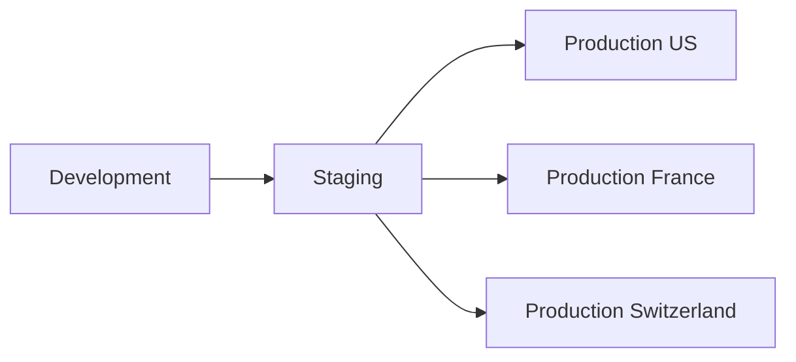

# Deployment Workflows Documentation

## Overview

This document describes the deployment workflows for the MSPR 3 pandemic surveillance platform, covering automated deployments to different environments and clusters.

## Deployment Strategy

### Environment Progression



### Deployment Environments

1. **Development** - Feature development and testing
2. **Staging** - Pre-production validation
3. **Production Clusters:**
   - **US Cluster** - Full feature set
   - **France Cluster** - GDPR compliant
   - **Switzerland Cluster** - Multi-language support

## Cluster-Specific Configurations

### US Cluster (Complete Platform)

**Services Deployed:**
- Frontend (Next.js)
- Backend API (Node.js)
- Technical API (data access)
- Dataviz solution
- ETL pipeline
- PostgreSQL database

**Configuration:**
```yaml
environment: production-us
features:
  - api_technical: true
  - dataviz: true
  - etl: true
  - all_languages: false
languages: [en]
compliance:
  gdpr: false
  high_volume: true
```

### France Cluster (GDPR Compliant)

**Services Deployed:**
- Frontend (Next.js) - French interface
- Backend API (Node.js)
- Dataviz solution
- ETL pipeline
- PostgreSQL database

**Configuration:**
```yaml
environment: production-france
features:
  - api_technical: false
  - dataviz: true
  - etl: true
  - gdpr_compliance: true
languages: [fr]
compliance:
  gdpr: true
  data_retention_days: 90
  dpo_contact: true
```

### Switzerland Cluster (Multi-language)

**Services Deployed:**
- Frontend (Next.js) - Multi-language
- Backend API (Node.js)
- ETL pipeline
- PostgreSQL database

**Configuration:**
```yaml
environment: production-switzerland
features:
  - api_technical: false
  - dataviz: false
  - etl: true
  - multilingual: true
languages: [fr, de, it]
compliance:
  gdpr: true
  minimal_config: true
```

## Deployment Workflows

### GitHub Actions Deployment Pipeline

```yaml
name: Deploy to Production

on:
  push:
    branches: [main]
    paths:
      - 'site/**'
      - 'rest/**'
      - 'infrastructure/**'
  
  workflow_dispatch:
    inputs:
      environment:
        description: 'Deployment environment'
        required: true
        default: 'staging'
        type: choice
        options:
          - staging
          - production-us
          - production-france
          - production-switzerland

jobs:
  build:
    runs-on: ubuntu-latest
    outputs:
      image-tag: ${{ steps.build.outputs.tag }}
    
    steps:
      - name: Checkout code
        uses: actions/checkout@v4
      
      - name: Build Docker images
        id: build
        run: |
          TAG=${GITHUB_SHA::8}
          echo "tag=$TAG" >> $GITHUB_OUTPUT
          
          # Build frontend
          docker build -t mspr-frontend:$TAG -f infrastructure/docker/Dockerfile.frontend .
          
          # Build backend
          docker build -t mspr-backend:$TAG -f infrastructure/docker/Dockerfile.backend .
          
          # Build ETL
          docker build -t mspr-etl:$TAG -f infrastructure/docker/Dockerfile.etl .

  deploy-staging:
    needs: build
    if: github.ref == 'refs/heads/main' || github.event.inputs.environment == 'staging'
    runs-on: ubuntu-latest
    environment: staging
    
    steps:
      - name: Deploy to Staging
        run: |
          echo "Deploying to staging environment..."
          # Deployment commands for staging

  deploy-us:
    needs: [build, deploy-staging]
    if: github.event.inputs.environment == 'production-us' || github.ref == 'refs/heads/main'
    runs-on: ubuntu-latest
    environment: production-us
    
    steps:
      - name: Deploy to US Cluster
        env:
          CLUSTER_CONFIG: production-us
          FEATURES: "api_technical,dataviz,etl"
          LANGUAGES: "en"
        run: |
          echo "Deploying to US production cluster..."
          # US-specific deployment commands

  deploy-france:
    needs: [build, deploy-staging]
    if: github.event.inputs.environment == 'production-france' || github.ref == 'refs/heads/main'
    runs-on: ubuntu-latest
    environment: production-france
    
    steps:
      - name: Deploy to France Cluster
        env:
          CLUSTER_CONFIG: production-france
          FEATURES: "dataviz,etl"
          LANGUAGES: "fr"
          GDPR_COMPLIANCE: "true"
        run: |
          echo "Deploying to France production cluster..."
          # France-specific deployment commands

  deploy-switzerland:
    needs: [build, deploy-staging]
    if: github.event.inputs.environment == 'production-switzerland' || github.ref == 'refs/heads/main'
    runs-on: ubuntu-latest
    environment: production-switzerland
    
    steps:
      - name: Deploy to Switzerland Cluster
        env:
          CLUSTER_CONFIG: production-switzerland
          FEATURES: "etl"
          LANGUAGES: "fr,de,it"
          MULTILINGUAL: "true"
        run: |
          echo "Deploying to Switzerland production cluster..."
          # Switzerland-specific deployment commands
```

## Infrastructure as Code

### Terraform Configuration

```hcl
# infrastructure/terraform/main.tf

module "us_cluster" {
  source = "./modules/cluster"
  
  cluster_name = "us-production"
  region = "us-east-1"
  
  features = {
    api_technical = true
    dataviz = true
    etl = true
  }
  
  languages = ["en"]
  
  gdpr_compliance = false
  high_volume = true
}

module "france_cluster" {
  source = "./modules/cluster"
  
  cluster_name = "france-production"
  region = "eu-west-3"
  
  features = {
    api_technical = false
    dataviz = true
    etl = true
  }
  
  languages = ["fr"]
  
  gdpr_compliance = true
  data_retention_days = 90
}

module "switzerland_cluster" {
  source = "./modules/cluster"
  
  cluster_name = "switzerland-production"
  region = "eu-central-1"
  
  features = {
    api_technical = false
    dataviz = false
    etl = true
  }
  
  languages = ["fr", "de", "it"]
  
  gdpr_compliance = true
  minimal_config = true
}
```

### Docker Compose for Development

```yaml
# infrastructure/docker/docker-compose.prod.yml

version: '3.8'

services:
  frontend:
    build:
      context: ../..
      dockerfile: infrastructure/docker/Dockerfile.frontend
    environment:
      - CLUSTER_NAME=${CLUSTER_NAME}
      - LANGUAGES=${LANGUAGES}
      - FEATURES=${FEATURES}
    ports:
      - "3000:3000"
    depends_on:
      - backend

  backend:
    build:
      context: ../..
      dockerfile: infrastructure/docker/Dockerfile.backend
    environment:
      - NODE_ENV=production
      - DATABASE_URL=${DATABASE_URL}
      - API_TOKEN=${API_TOKEN}
      - CLUSTER_FEATURES=${FEATURES}
    ports:
      - "3001:3001"
    depends_on:
      - postgres

  etl:
    build:
      context: ../..
      dockerfile: infrastructure/docker/Dockerfile.etl
    environment:
      - DATABASE_URL=${DATABASE_URL}
      - ETL_SCHEDULE=${ETL_SCHEDULE:-"0 2 * * *"}
    depends_on:
      - postgres

  postgres:
    image: postgres:15
    environment:
      - POSTGRES_DB=${POSTGRES_DB}
      - POSTGRES_USER=${POSTGRES_USER}
      - POSTGRES_PASSWORD=${POSTGRES_PASSWORD}
    volumes:
      - postgres_data:/var/lib/postgresql/data
      - ./postgres/init-scripts:/docker-entrypoint-initdb.d
    ports:
      - "5432:5432"

volumes:
  postgres_data:
```

## Configuration Management

### Environment-Specific Configuration

#### US Cluster Configuration

```bash
# .env.production.us
NODE_ENV=production
CLUSTER_NAME=us-production
CLUSTER_FEATURES=api_technical,dataviz,etl
CLUSTER_LANGUAGES=en

# Performance optimizations
HIGH_VOLUME_MODE=true
CACHE_ENABLED=true
RATE_LIMIT_WINDOW=900000
RATE_LIMIT_MAX=1000

# Monitoring
MONITORING_ENABLED=true
METRICS_ENDPOINT=/metrics
```

#### France Cluster Configuration

```bash
# .env.production.france
NODE_ENV=production
CLUSTER_NAME=france-production
CLUSTER_FEATURES=dataviz,etl
CLUSTER_LANGUAGES=fr

# GDPR Compliance
GDPR_COMPLIANCE=true
DATA_RETENTION_DAYS=90
COOKIE_CONSENT_REQUIRED=true
DPO_CONTACT_EMAIL=dpo@mspr-france.org

# Monitoring
MONITORING_ENABLED=true
GDPR_AUDIT_LOGGING=true
```

#### Switzerland Cluster Configuration

```bash
# .env.production.switzerland
NODE_ENV=production
CLUSTER_NAME=switzerland-production
CLUSTER_FEATURES=etl
CLUSTER_LANGUAGES=fr,de,it

# Multi-language support
DEFAULT_LANGUAGE=fr
LANGUAGE_DETECTION=true
TRANSLATION_API_ENABLED=true

# Minimal configuration
MINIMAL_CONFIG=true
MONITORING_ENABLED=true
```

## Deployment Scripts

### Automated Deployment Script

```bash
#!/bin/bash
# infrastructure/scripts/deploy.sh

set -e

CLUSTER=$1
ENVIRONMENT=${2:-production}
TAG=${3:-latest}

if [ -z "$CLUSTER" ]; then
    echo "Usage: $0 <cluster> [environment] [tag]"
    echo "Clusters: us, france, switzerland"
    exit 1
fi

echo "🚀 Deploying to $CLUSTER cluster (environment: $ENVIRONMENT, tag: $TAG)"

# Load cluster-specific configuration
source "config/cluster-${CLUSTER}.env"

# Pre-deployment checks
echo "📋 Running pre-deployment checks..."
./scripts/pre-deploy-checks.sh "$CLUSTER"

# Database migrations
echo "🗄️ Running database migrations..."
./scripts/migrate.sh "$CLUSTER"

# Deploy services based on cluster features
echo "🔧 Deploying services..."

# Always deploy core services
docker-compose -f "docker-compose.${CLUSTER}.yml" up -d postgres backend frontend

# Deploy optional services based on cluster features
if [[ "$CLUSTER_FEATURES" == *"etl"* ]]; then
    echo "📊 Deploying ETL service..."
    docker-compose -f "docker-compose.${CLUSTER}.yml" up -d etl
fi

if [[ "$CLUSTER_FEATURES" == *"api_technical"* ]]; then
    echo "🔌 Deploying Technical API..."
    docker-compose -f "docker-compose.${CLUSTER}.yml" up -d api-technical
fi

if [[ "$CLUSTER_FEATURES" == *"dataviz"* ]]; then
    echo "📈 Deploying DataViz service..."
    docker-compose -f "docker-compose.${CLUSTER}.yml" up -d dataviz
fi

# Health checks
echo "🏥 Running health checks..."
./scripts/health-check.sh "$CLUSTER"

# Post-deployment tasks
echo "🎯 Running post-deployment tasks..."
./scripts/post-deploy.sh "$CLUSTER"

echo "✅ Deployment to $CLUSTER cluster completed successfully!"
```

### Health Check Script

```bash
#!/bin/bash
# infrastructure/scripts/health-check.sh

CLUSTER=$1
MAX_RETRIES=30
RETRY_INTERVAL=10

check_service() {
    local service=$1
    local url=$2
    local retries=0

    echo "Checking $service health..."
    
    while [ $retries -lt $MAX_RETRIES ]; do
        if curl -f -s "$url" > /dev/null; then
            echo "✅ $service is healthy"
            return 0
        fi
        
        echo "⏳ Waiting for $service... (attempt $((retries+1))/$MAX_RETRIES)"
        sleep $RETRY_INTERVAL
        retries=$((retries+1))
    done
    
    echo "❌ $service health check failed"
    return 1
}

# Load cluster configuration
source "config/cluster-${CLUSTER}.env"

# Check core services
check_service "Backend API" "http://localhost:3001/"
check_service "Frontend" "http://localhost:3000/"

# Check optional services based on cluster features
if [[ "$CLUSTER_FEATURES" == *"api_technical"* ]]; then
    check_service "Technical API" "http://localhost:3002/health"
fi

if [[ "$CLUSTER_FEATURES" == *"dataviz"* ]]; then
    check_service "DataViz Service" "http://localhost:3003/health"
fi

echo "🎉 All services are healthy for $CLUSTER cluster!"
```

## Rollback Procedures

### Automated Rollback

```bash
#!/bin/bash
# infrastructure/scripts/rollback.sh

CLUSTER=$1
PREVIOUS_TAG=$2

echo "🔄 Rolling back $CLUSTER cluster to tag $PREVIOUS_TAG"

# Stop current services
docker-compose -f "docker-compose.${CLUSTER}.yml" down

# Deploy previous version
TAG=$PREVIOUS_TAG ./infrastructure/scripts/deploy.sh "$CLUSTER"

# Verify rollback
./infrastructure/scripts/health-check.sh "$CLUSTER"

echo "✅ Rollback completed successfully!"
```

### Database Rollback

```bash
#!/bin/bash
# infrastructure/scripts/rollback-db.sh

CLUSTER=$1
MIGRATION_VERSION=$2

echo "🗄️ Rolling back database for $CLUSTER to version $MIGRATION_VERSION"

# Load cluster database URL
source "config/cluster-${CLUSTER}.env"

# Run Prisma migration rollback
npx prisma migrate reset --force --schema="prisma/schema.${CLUSTER}.prisma"
npx prisma migrate deploy --schema="prisma/schema.${CLUSTER}.prisma"

echo "✅ Database rollback completed!"
```

## Monitoring and Alerting

### Deployment Monitoring

```yaml
# infrastructure/monitoring/deployment-alerts.yml

alerts:
  - name: deployment_failure
    condition: deployment_status == "failed"
    severity: critical
    notifications:
      - slack: "#alerts"
      - email: "devops@mspr.org"

  - name: health_check_failure
    condition: service_health == "unhealthy"
    severity: high
    notifications:
      - slack: "#monitoring"
      - pager: "on-call"

  - name: rollback_triggered
    condition: rollback_initiated == true
    severity: medium
    notifications:
      - slack: "#deployments"
      - email: "team@mspr.org"
```

### Performance Monitoring

```typescript
// monitoring/deployment-metrics.ts

export interface DeploymentMetrics {
  deploymentDuration: number;
  servicesDeployed: string[];
  healthCheckResults: Record<string, boolean>;
  rollbackRequired: boolean;
  clusterName: string;
}

export const trackDeployment = async (metrics: DeploymentMetrics) => {
  // Send metrics to monitoring system
  await sendMetrics('deployment.completed', {
    duration: metrics.deploymentDuration,
    cluster: metrics.clusterName,
    success: !metrics.rollbackRequired,
    services_count: metrics.servicesDeployed.length
  });
};
```

## Security Considerations

### Deployment Security

1. **Secret Management**
   - Use GitHub secrets for sensitive data
   - Rotate secrets regularly
   - Audit secret access

2. **Access Control**
   - Restrict deployment permissions
   - Require approvals for production
   - Log all deployment activities

3. **Image Security**
   - Scan container images for vulnerabilities
   - Use minimal base images
   - Sign images for integrity

### Compliance Requirements

#### GDPR Compliance (France/Switzerland)

```bash
# GDPR-specific deployment checks
check_gdpr_compliance() {
    echo "🔒 Checking GDPR compliance..."
    
    # Verify data retention policies
    check_data_retention_config
    
    # Verify cookie consent implementation
    check_cookie_consent
    
    # Verify DPO contact information
    check_dpo_contact
    
    echo "✅ GDPR compliance verified"
}
```

This comprehensive deployment workflow ensures consistent, secure, and cluster-specific deployments for the MSPR 3 platform across all target environments.