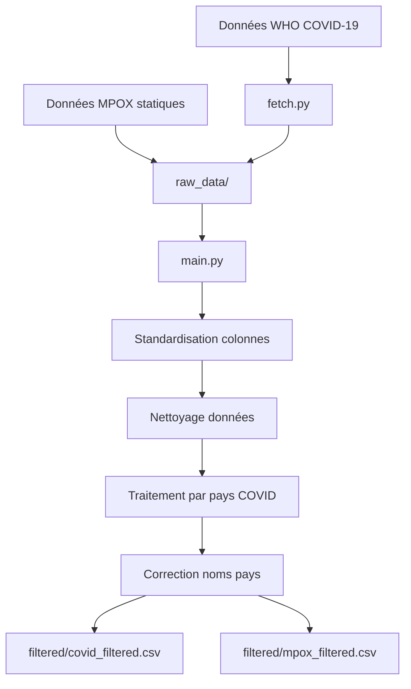

# Solution ETL Simplifiée en Python pour le Traitement des Données Pandémiques

## 1. Introduction

Ce projet met en place une solution ETL (Extract, Transform, Load) simplifiée en Python pour collecter, transformer et charger des données concernant les pandémies de COVID-19 et MPOX à partir de sources officielles et fiables. L'objectif est de préparer des données cohérentes et exploitables pour une analyse approfondie en utilisant Python et pandas pour un traitement efficace.

---

## 2. Objectif de la Solution ETL Simplifiée

L'objectif principal de cette solution ETL est de traiter des données provenant de sources officielles en trois étapes essentielles :

1. **Extraction** des données depuis l'OMS et un dataset MPOX statique
2. **Transformation** pour harmoniser, nettoyer et standardiser les données
3. **Chargement** des données nettoyées dans un format prêt à l'analyse

Cette approche privilégie la simplicité, la fiabilité et la maintenance par rapport à la complexité.

---

## 3. Description du Processus ETL

### 3.1. Extraction des Données (Extract)

L'extraction est effectuée à partir de deux sources principales :

#### 3.1.1. Sources de Données

-   **WHO COVID-19 Global Data** : Données officielles de l'Organisation Mondiale de la Santé
-   **MPOX Dataset** : Ensemble de données statique (mpox-22-june.csv)

#### 3.1.2. Processus de Téléchargement (fetch.py)

Le script `fetch.py` télécharge automatiquement les données COVID-19 depuis l'OMS :

```python
datasets = {
    "WHO-COVID-19-global-data.csv": {
        "url": "https://srhdpeuwpubsa.blob.core.windows.net/whdh/COVID/WHO-COVID-19-global-data.csv",
        "extract_to": "raw_data"
    }
}

def download_and_extract():
    for filename, info in datasets.items():
        command = f'curl -L -o "{file_path}" "{info["url"]}"'
        subprocess.run(command, shell=True, check=True)
        os.rename(file_path, os.path.join(extract_path, filename))
```

#### 3.1.3. Chargement des Fichiers

Les données sont lues avec un encodage UTF-8 explicite pour éviter les problèmes de caractères :

```python
data1 = pd.read_csv('raw_data/WHO-COVID-19-global-data.csv', encoding='utf-8')
data2 = pd.read_csv('raw_data/mpox-22-june.csv', encoding='utf-8')
```

---

### 3.2. Transformation des Données (Transform)

Les transformations sont simplifiées et standardisées pour assurer la cohérence :

#### 3.2.1. Définition du Schéma Cible

Un schéma uniforme est défini pour les deux types de données :

```python
data1_final_columns = ["date", "country", "total_cases", "new_cases", "total_deaths", "new_deaths"]
data2_final_columns = ["date", "country", "total_cases", "new_cases", "total_deaths", "new_deaths"]
```

#### 3.2.2. Standardisation des Noms de Colonnes

Les noms de colonnes sont normalisés :

```python
data1.columns = data1.columns.str.lower().str.replace(' ', '_')
data2.columns = data2.columns.str.lower().str.replace(' ', '_')
```

#### 3.2.3. Renommage pour Uniformisation

**Données COVID-19 (WHO) :**

```python
data1.rename(columns={
    "date_reported": "date",
    "country": "country",
    "cumulative_cases": "total_cases",
    "new_cases": "new_cases",
    "cumulative_deaths": "total_deaths",
    "new_deaths": "new_deaths"
}, inplace=True)
```

**Données MPOX :**

```python
data2.rename(columns={
    "date": "date",
    "country": "country",
    "total_conf_cases": "total_cases",
    "new_conf_cases": "new_cases",
    "total_conf_deaths": "total_deaths",
    "new_conf_deaths": "new_deaths"
}, inplace=True)
```

#### 3.2.4. Traitement des Dates

Conversion en format datetime pour les données MPOX :

```python
data2['date'] = pd.to_datetime(data2['date'])
```

#### 3.2.5. Gestion des Valeurs Manquantes

Remplacement uniforme des valeurs manquantes :

```python
data1.fillna(0, inplace=True)
data2.fillna(0, inplace=True)
```

#### 3.2.6. Traitement Spécial COVID-19

Pour assurer la cohérence des données COVID-19, un traitement par pays est effectué :

```python
# Séparation par pays
for country, group in data1.groupby("country"):
    os.makedirs('tempfilter', exist_ok=True)
    group.to_csv(f'tempfilter/{country}_data1_filtered.csv', index=False, encoding='utf-8')

# Rechargement et concaténation
all_datas = []
for file_name in os.listdir('tempfilter'):
    file_path = os.path.join('tempfilter', file_name)
    dataf = pd.read_csv(file_path, delimiter=',', encoding='utf-8')
    all_datas.append(dataf)

data1 = pd.concat(all_datas)

# Nettoyage des fichiers temporaires
for file_name in os.listdir('tempfilter'):
    os.remove(os.path.join('tempfilter', file_name))
os.rmdir('tempfilter')
```

#### 3.2.7. Nettoyage des Noms de Pays

Correction des caractères spéciaux problématiques :

```python
data1.replace("Côte d'Ivoire", "Cote d'Ivoire", inplace=True)
data1.replace("Türkiye", "Turkey", inplace=True)
data1.replace("Curaçao", "Curacao", inplace=True)
data1.replace("Réunion", "Reunion", inplace=True)
```

#### 3.2.8. Sélection Finale des Colonnes

Réduction aux colonnes standardisées :

```python
data1 = data1[data1_final_columns]
data2 = data2[data2_final_columns]
```

---

### 3.3. Chargement des Données (Load)

Les données transformées sont sauvegardées dans le dossier `filtered/` :

```python
os.makedirs('filtered', exist_ok=True)
data1.to_csv('filtered/covid_filtered.csv', index=False, encoding='utf-8')
data2.to_csv('filtered/mpox_filtered.csv', index=False, encoding='utf-8')
```

---

## 4. Avantages de la Solution ETL Simplifiée

### 4.1. Simplicité et Maintenabilité

-   **Code plus simple** : Moins de complexité, plus facile à comprendre et maintenir
-   **Moins de dépendances** : Aucune API Kaggle, pas de gestion de tokens
-   **Processus direct** : Téléchargement direct depuis les sources officielles

### 4.2. Fiabilité des Sources

-   **Données OMS** : Source officielle et autoritaire pour COVID-19
-   **Contrôle qualité** : Données vérifiées et cohérentes
-   **Mise à jour régulière** : L'OMS maintient ses données à jour

### 4.3. Performance Optimisée

-   **Moins de fichiers** : Seulement 2 sources vs 3+ précédemment
-   **Traitement plus rapide** : Moins d'étapes de transformation complexes
-   **Mémoire optimisée** : Gestion efficace des fichiers temporaires

### 4.4. Robustesse

-   **Gestion des erreurs** : Try/catch pour les lectures de fichiers
-   **Encodage uniforme** : UTF-8 partout pour éviter les problèmes de caractères
-   **Nettoyage automatique** : Suppression des fichiers temporaires

---

## 5. Architecture des Données Finales

### 5.1. Structure Uniforme

Les deux datasets finaux partagent la même structure :

| Colonne      | Type    | Description               |
| ------------ | ------- | ------------------------- |
| date         | string  | Date au format AAAA-MM-JJ |
| country      | string  | Nom du pays               |
| total_cases  | integer | Cas cumulés confirmés     |
| new_cases    | integer | Nouveaux cas du jour      |
| total_deaths | integer | Décès cumulés             |
| new_deaths   | integer | Nouveaux décès du jour    |

### 5.2. Fichiers de Sortie

-   **`filtered/covid_filtered.csv`** : Données COVID-19 de l'OMS
-   **`filtered/mpox_filtered.csv`** : Données MPOX nettoyées

---

## 6. Comparaison : Ancienne vs Nouvelle Approche

| Aspect              | Ancienne Approche | Nouvelle Approche           |
| ------------------- | ----------------- | --------------------------- |
| **Sources**         | 3 sources Kaggle  | 2 sources (OMS + statique)  |
| **Complexité**      | Élevée            | Simplifiée                  |
| **Dépendances**     | API Kaggle        | Curl seulement              |
| **Maintenance**     | Difficile         | Facile                      |
| **Fiabilité**       | Variable          | Haute (sources officielles) |
| **Performance**     | Moyenne           | Optimisée                   |
| **Gestion erreurs** | Basique           | Robuste                     |

---

## 7. Flux de Traitement



---

## 8. Guide d'Utilisation

### 8.1. Exécution Complète

```bash
# 1. Télécharger les données
python fetch.py

# 2. Traiter les données
python main.py
```

### 8.2. Résultats

Les fichiers finaux seront disponibles dans :

-   `filtered/covid_filtered.csv`
-   `filtered/mpox_filtered.csv`

---

## 9. Conclusion

Cette solution ETL simplifiée offre une approche pragmatique et efficace pour le traitement des données pandémiques. Elle privilégie :

-   **La simplicité** sur la complexité
-   **La fiabilité** des sources officielles
-   **La maintenabilité** du code
-   **La performance** du traitement

Cette architecture est idéale pour des besoins d'analyse de données épidémiologiques nécessitant des sources fiables et un traitement robuste, tout en restant facilement extensible pour de futures améliorations.
